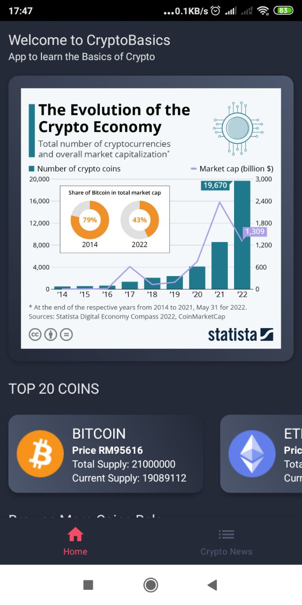
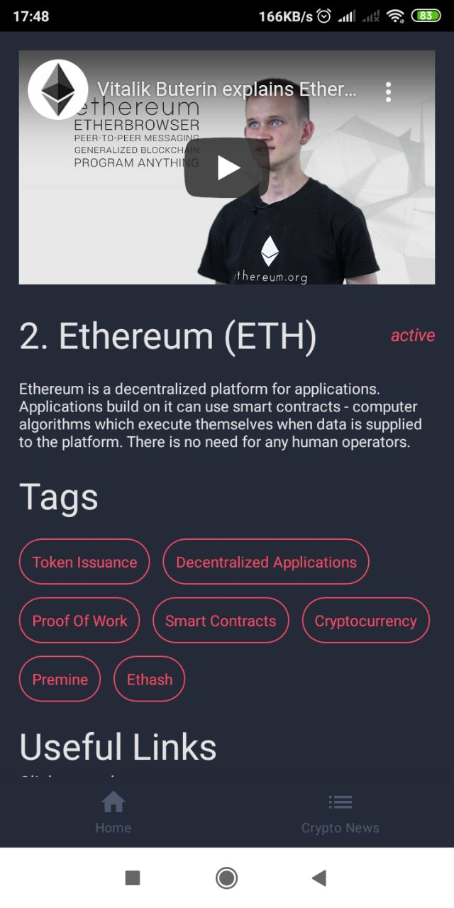

# CryptoBasics
Crypto app for crypto beginners

 

[Playstore Link](https://play.google.com/store/apps/details?id=com.vasan.cryptobasics)

- [Jetpack Compose](https://developer.android.com/jetpack/compose)
- [Kotlin Coroutines](https://developer.android.com/kotlin/coroutines?gclid=CjwKCAjwj6SEBhAOEiwAvFRuKKXAVffTbMzF5R2cZYPvXRCR-cnlfgjncIxXBK59y9m86KftO_aqdBoCoS0QAvD_BwE&gclsrc=aw.ds)
- [MVVM Architecture & ViewModel](https://developer.android.com/jetpack/guide?gclid=CjwKCAjwj6SEBhAOEiwAvFRuKHuHt1pTUyslihJ4oyClRc4S3v-ZD24xObP0sz972zFaZGvGcAaleBoCIJMQAvD_BwE&gclsrc=aw.ds)
- [Live data](https://developer.android.com/topic/libraries/architecture/livedata)
- [Navigation & Paging](https://developer.android.com/guide/navigation#:~:text=Navigation%20refers%20to%20the%20interactions,bars%20and%20the%20navigation%20drawer.)
- [Retrofit](https://square.github.io/retrofit/)
- [Dagger Hilt](https://developer.android.com/training/dependency-injection/hilt-android)
- [Video Player](https://github.com/PierfrancescoSoffritti/android-youtube-player)
- [Image Loader](https://coil-kt.github.io/coil/compose/) 
- [Pager](https://google.github.io/accompanist/pager/)
- [Lottie](https://github.com/airbnb/lottie-android)

### UI Screen Shot

 

